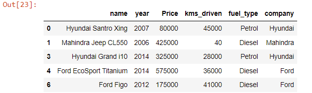

# Predict Car Price

1. Data Load
2. Data Cleaning
3. Feature Engineering
4. Outlier Removal
5. Data Visualization (Relationship Between Variables)
6. Extracting Training Data
7. Encoding
8. Build a Model

 

## Data Load
    df = pd.read_csv("cars.csv")
    df.head()

 

## Feature Engineering
**Add new feature for company names**

    df["company"] = df.name.apply(lambda x: x.split(" ")[0])
    df.head()

 

## Data Cleaning
**year has many non-year values**

    df2 = df.copy()
    df2 = df2[df2["year"].str.isnumeric()]

**year is in object. Change to integer**

    df2["year"] = df2["year"].astype(int)

**Price has Ask for Price**

    df2 = df2[df2["Price"] != "Ask For Price"]
    df2.Price

**Price has commas in its prices and is in object**

    df2.Price = df2.Price.str.replace(",","").astype(int)

**kms_driven has object values with kms at last.**

    df2["kms_driven"]

    df2["kms_driven"] = df2["kms_driven"].str.split(" ").str.get(0).str.replace(",","")

**It has nan values and two rows have 'Petrol' in them**

    df2 = df2[df2["kms_driven"].str.isnumeric()]
    df2.info()

    df2["kms_driven"] = df2["kms_driven"].astype(int)

**fuel_type has nan values**

    df2[df2["fuel_type"].isna()]

    df2 = df2[~df2["fuel_type"].isna()]

**Changing car names. Keeping only the first three words**

    df2['name']=df2['name'].str.split().str.slice(start=0,stop=3).str.join(' ')
    df2.head()

**Resetting the index of the final cleaned data**

    df2 = df2.reset_index(drop=True)

**Save the clanned data**

    df2.to_csv("cleaned_car_data.csv")
    df2.describe(include="all")

 

## Outlier Removal
**Drop the price outliers**

    df2 = df2[df2["Price"]<6e6].reset_index(drop=True)
    df2

 

## Data Visualization
**Checking relationship of Company with Price**

    df2["company"].unique()

    import seaborn as sns

    plt.subplots(figsize=(15,7))
    ax=sns.boxplot(x='company',y='Price',data=df2)
    ax.set_xticklabels(ax.get_xticklabels(),rotation=40,ha='right')
    plt.show()

**Checking relationship of Year with Price**

    plt.subplots(figsize=(20,10))
    ax=sns.swarmplot(x='year',y='Price',data=df2)
    ax.set_xticklabels(ax.get_xticklabels(),rotation=40,ha='right')
    plt.show()

**Checking relationship of kms_driven with Price**

    sns.relplot(x='kms_driven',y='Price',data=df2,height=7,aspect=1.5)

**Checking relationship of Fuel Type with Price**

    plt.subplots(figsize=(14,7))
    sns.boxplot(x='fuel_type',y='Price',data=df2)

**Relationship of Price with FuelType, Year and Company mixed**

    ax=sns.relplot(x='company',y='Price',data=df2,hue='fuel_type',size='year',height=7,aspect=2)
    ax.set_xticklabels(rotation=40,ha='right')

 

## Extracting Training Data

    X=df2[['name','company','year','kms_driven','fuel_type']]
    y=df2['Price']

    X

**Applying Train Test Split**

    from sklearn.model_selection import train_test_split
    X_train,X_test,y_train,y_test=train_test_split(X,y,test_size=0.2)

 

## Encoding

 **Creating an OneHotEncoder object to contain all the possible categories**

    from sklearn.linear_model import LinearRegression

    from sklearn.preprocessing import OneHotEncoder
    from sklearn.compose import make_column_transformer
    from sklearn.pipeline import make_pipeline
    from sklearn.metrics import r2_score

    ohe=OneHotEncoder()
    ohe.fit(X[['name','company','fuel_type']])

**Creating a column transformer to transform categorical columns**

    column_trans=make_column_transformer((OneHotEncoder(categories=ohe.categories_),['name','company','fuel_type']),
                                    remainder='passthrough')

 

## Build a Model
**Linear Regression Model**

    lr=LinearRegression()

**Making a pipeline**

    pipe=make_pipeline(column_trans,lr)

**Fitting the model**

    pipe.fit(X_train,y_train)

    y_pred=pipe.predict(X_test)

**Checking R2 Score**

    r2_score(y_test,y_pred)

**Finding the model with a random state of TrainTestSplit where the model was found to give almost 0.92 as r2_score**

    scores=[]
    for i in range(1000):
        X_train,X_test,y_train,y_test=train_test_split(X,y,test_size=0.1,random_state=i)
        lr=LinearRegression()
        pipe=make_pipeline(column_trans,lr)
        pipe.fit(X_train,y_train)
        y_pred=pipe.predict(X_test)
        scores.append(r2_score(y_test,y_pred))

    scores[np.argmax(scores)]

**Predict spesific car price**

    pipe.predict(pd.DataFrame(columns=X_test.columns,data=np.array(['Maruti Suzuki Swift','Maruti',2019,100,'Petrol']).reshape(1,5)))

  

**The best model is found at a certain random state**

    X_train,X_test,y_train,y_test=train_test_split(X,y,test_size=0.1,random_state=np.argmax(scores))
    lr=LinearRegression()
    pipe=make_pipeline(column_trans,lr)
    pipe.fit(X_train,y_train)
    y_pred=pipe.predict(X_test)
    r2_score(y_test,y_pred)

  

    import pickle

    pickle.dump(pipe,open('LinearRegressionModel.pkl','wb'))

    pipe.predict(pd.DataFrame(columns=['name','company','year','kms_driven','fuel_type'],data=np.array(['Maruti Suzuki Swift','Maruti',2019,100,'Petrol']).reshape(1,5)))

 

