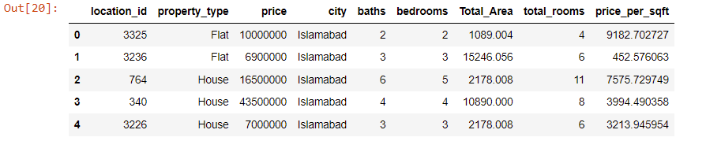

# Predict Home Price

1. Data Load
2. Data Cleaning
3. Feature Engineering
4. Dimensionality Reduction
5. Outlier Removal
6. Data Visualization (Relationship Between Variables)
7. Encoding
8. Build a Model

    8.1 Linear Regression Model

    8.2 Ridge Regression

    8.3 Comparison of Linear And Decision Tree Algorithms

    8.4 Comparison of Other Algorithms

 

## Data Load
    df = pd.read_csv("Entities.csv")
    df.head()

 

## Data Cleaning

### Drop features that are not required to build our model

    df2 = df.drop(["Unnamed: 0","property_id","location","page_url","province_name","latitude","longitude","date_added","agency","agent"], axis = 1)
    df2.head()

### Handle NA values

    df2.isnull().sum()

 

## Feature Engineering

    df3.drop("purpose",axis=1,inplace=True)

### Let's add a label that shows the total number of rooms in the houses.

    df3["total_rooms"] = df3["baths"] + df3["bedrooms"]

### Let's add a label showing the price per square meter for each house.

    df3["price_per_sqft"] = df3["price"] / df3["Total_Area"]

 

## Dimensionality Reduction

### Any location having less than 100 data points should be tagged as "other" location.

    location_stats = df3["location_id"].value_counts(ascending = False)
    location_stats

    location_stats_less_than_100 = location_stats[location_stats<=100]
    location_stats_less_than_100

    df3.location_id = df3.location_id.apply(lambda x: 999 if x in location_stats_less_than_100 else x)
    len(df3.location_id.unique())
    
 

## Outlier Removal
### Outlier Removal Using Business Logic
**It is unusual to have 5 more bathrooms than number of bedrooms in a home**

    df4 = df3[df3.baths<df3.bedrooms+5]

### Outlier Removal Using Standard Deviation and Mean
**We should remove outliers per location using mean and one standard deviation**

    def remove_pps_outliers(df) :
        df_out = pd.DataFrame()
        for key, subdf in df.groupby("location_id") :
            m = np.mean(subdf.price_per_sqft)
            st = np.std(subdf.price_per_sqft)
            reduced_df = subdf[(subdf.price_per_sqft>(m-st)) & (subdf.price_per_sqft <= (m+st))]
            df_out = pd.concat([df_out, reduced_df], ignore_index = True)
        return df_out
    df5 = remove_pps_outliers(df4)

**Let's check if for a given location how does the 2 baths and 3 baths property prices look like**

    def plot_scatter_chart(df,location) :
        bath2 = df[(df.location_id == location) & (df.baths < 3)]
        bath3 = df[(df.location_id == location) & (df.baths >= 3)]
        matplotlib.rcParams["figure.figsize"] = (15,10)
        plt.scatter(bath2.Total_Area, bath2.price, color = "blue", label = "2 baths", s = 50)
        plt.scatter(bath3.Total_Area, bath3.price, marker = "+", color = "green", label = "3 baths", s = 50)
        plt.xlabel("Total Square Feet Area")
        plt.ylabel("Price")
        plt.title(location)
        plt.legend()
    
    plot_scatter_chart(df5, 5)

**Now we can remove those 2 baths apartments whose price_per_sqft is less than mean price_per_sqft of 1 baths apartment**

    def remove_baths_outliers(df) :
        exclude_indices = np.array([])
        for location, location_df in df.groupby("location_id") :
            baths_stats = {}
            for baths, baths_df in location_df.groupby("baths") :
                baths_stats[baths] = {
                    "mean" : np.mean(baths_df.price_per_sqft),
                    "std" : np.std(baths_df.price_per_sqft),
                    "count" : baths_df.shape[0]
                }
            for baths, baths_df in location_df.groupby("baths"):
                stats = baths_stats.get(baths - 1)
                if stats and stats["count"]> 5 :
                    exclude_indices = np.append(exclude_indices, baths_df[baths_df.price_per_sqft<(stats["mean"])].index.values)
        return df.drop(exclude_indices, axis="index")
    df6 = remove_baths_outliers(df5)

**Plot same scatter chart again to visualize price_per_sqft for 2 baths and 3 baths properties**

    plot_scatter_chart(df6, 5)

### Automate outlier deletion using location_id

    label_list = ["price","baths","bedrooms","total_rooms","price_per_sqft"]
    df7 = df6.copy()

    for column in label_list :
        for location_id in df7["location_id"].unique() :
            selected_location = df7[df7["location_id"] == location_id]
            selected_column = selected_location[column]
            
            std = selected_column.std()
            avg = selected_column.mean()
            
            three_sigma_plus = avg + (std*3)
            three_sigma_minus = avg - (std*3)
            
            outliers = selected_column[(selected_location[column] > three_sigma_plus) | (selected_location[column] < three_sigma_minus)].index
            df7.drop(index = outliers, inplace = True)

 

## Data Visualization (Relationship Between Variables)

    sns.barplot(x = "city", y = df7.city.index, data = df7);

### Checking relationship of city with price

    plt.subplots(figsize=(15,7))
    plt.ylim(0,50000000)
    ax=sns.boxplot(x='city',y='price',data=df7)
    ax.set_xticklabels(ax.get_xticklabels(),rotation=40,ha='right')
    plt.show()

### Checking relationship of property_type with price

    plt.subplots(figsize=(15,7))
    plt.ylim(0,70000000)
    ax=sns.boxplot(x='property_type',y='price',data=df7)
    ax.set_xticklabels(ax.get_xticklabels(),rotation=40,ha='right')
    plt.show()

### Relationship of price with city, and total_rooms mixed

    ax=sns.relplot(x='total_rooms',y='price',data=df7,hue='city',height=7,aspect=2)
    ax.set_xticklabels(rotation=40,ha='right')

 

## Encoding
### Use Label Encoder For property_type and city

    df8 = df7.drop(["total_rooms","price_per_sqft"], axis = "columns")
    df8.head()

    from sklearn.preprocessing import LabelEncoder
    le = LabelEncoder()
    df9 = df8.copy()
    df9["property_type"] = le.fit_transform(df9["property_type"])

    df9["city"] = le.fit_transform(df9["city"])

### Use One Hot Encoding For Location

    dummies = pd.get_dummies(df9.location_id)
    dummies.head()  

    df10 = pd.concat([df9, dummies.drop(999,axis = "columns")], axis = "columns")
    df10.head()

    df10.drop("location_id",axis=1, inplace = True)

 

## Build a Model

    X = df10.drop(["price"], axis="columns")
    X.head()

    y = df10.price

### Train Test Split

    from sklearn.model_selection import train_test_split
    X_train, X_test, y_train, y_test = train_test_split(X,y,test_size=0.2,random_state=10)

### Linear Regression Model

    from sklearn.linear_model import LinearRegression

    lr_clf = LinearRegression()
    lr_clf.fit(X_train, y_train)
    lr_clf.score(X_test, y_test)

**Use K Fold cross validation to measure accuracy of our LinearRegression model**

    from sklearn.model_selection import ShuffleSplit
    from sklearn.model_selection import cross_val_score

    cv = ShuffleSplit(n_splits = 5, test_size = 0.2, random_state=0)

    cross_val_score(LinearRegression(), X, y, cv=cv)

### Ridge Regression Model

    from sklearn.linear_model import Ridge
    ridge_model = Ridge(alpha = 0.1,normalize=True).fit(X_train, y_train)
    ridge_model.score(X_test, y_test)

### Comparison of linear and decision tree algorithms

    from sklearn.model_selection import GridSearchCV
    from sklearn.tree import DecisionTreeRegressor

    def find_best_model_using_gridsearchcv(X,y):
        algos = {
            'linear_regression' : {
                'model': LinearRegression(),
                'params': {
                    'normalize': [True, False]
                }
            },
            'decision_tree': {
                'model': DecisionTreeRegressor(),
                'params': {
                    'criterion' : ['mse','friedman_mse'],
                    'splitter': ['best','random']
                }
            }
        }
        scores = []
        cv = ShuffleSplit(n_splits = 5, test_size=0.2, random_state = 0)
        for algo_name, config in algos.items() :
            gs = GridSearchCV(config["model"], config["params"], cv = cv, return_train_score=False)
            gs.fit(X,y)
            scores.append({
                "model" : algo_name,
                "best_score" : gs.best_score_,
                "best_params" : gs.best_params_
            })
            
        return pd.DataFrame(scores,columns=["model","best_score","best_params"])
    find_best_model_using_gridsearchcv(X,y)

### Comparison of other algorithms

    from sklearn.tree import DecisionTreeRegressor
    from sklearn.neighbors import KNeighborsRegressor
    from sklearn.ensemble import RandomForestRegressor
    from sklearn.ensemble import GradientBoostingRegressor
    from lightgbm import LGBMRegressor
    import xgboost
    from xgboost import XGBRegressor

    def compML(df, alg) :
        X = df.drop(["price"], axis="columns")
        y = df.price
        X_train, X_test, y_train, y_test = train_test_split(X,y,test_size=0.2,random_state=10)
        
        
        model = alg().fit(X_train, y_train)
        y_pred=model.predict(X_test)
        model_name = alg.__name__
        print(model_name,":", (r2_score(y_test,y_pred)))

    models = [LGBMRegressor,
         XGBRegressor,
         GradientBoostingRegressor,
         RandomForestRegressor,
         DecisionTreeRegressor,   
         KNeighborsRegressor,]

    for i in models :
        compML(df10, i)

