# Predict Home Price

1) Data Load

2) Data Cleaning

3) Feature Engineering

4) Dimensionality Reduction

5) Outlier Removal 

6) One Hot Encoding

7) Build a Model

8) K Fold Cross Validation

9) Test The Model

10) Export The Tested Model

 

## Data Load

Let's assign the dataset containing the home prices to the variable df1 using pandas.

 

    df1 = pd.read_csv("Bengaluru_House_Data.csv")
    df1.head()

 

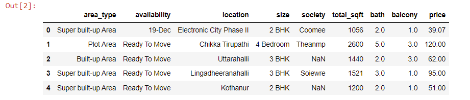

 

## Data Cleaning

    df3 = df2.dropna()
    df3.isnull().sum()

 

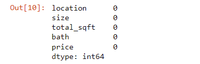

 

## Feature Engineering

Add new feature(integer) for bhk (Bedrooms Hall Kitchen)

 

    df3["bhk"] = df3["size"].apply(lambda x: int(x.split(" ")[0]))
    df3.bhk.unique()

 

    def is_float(x) :
    try :
        float(x)
    except :
        return False
    return True

 

    df3[~df3["total_sqft"].apply(is_float)].head(10)

 

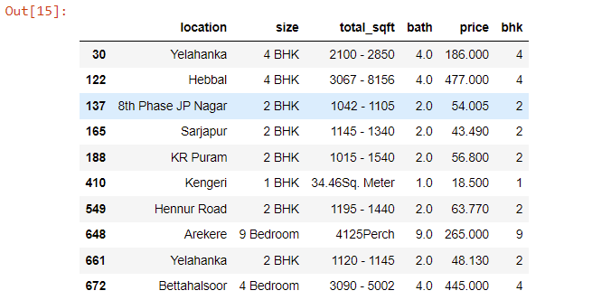

 

Above shows that total_sqft can be a range (e.g. 2100-2850). For such case we can just take average of min and max value in the range. There are other cases such as 34.46Sq. Meter which one can convert to square ft using unit conversion. I am going to just drop such corner cases to keep things.

 

    def convert_sqft_to_num(x) :
        tokens = x.split("-")
        if len(tokens) == 2 :
            return (float(tokens[0]) + float(tokens[1])) / 2
        try :
            return float(x)
        except :
            return None

    df4 = df3.copy()
    df4.total_sqft = df4.total_sqft.apply(convert_sqft_to_num)
    df4 = df4[df4.total_sqft.notnull()]
    df4.head()

 

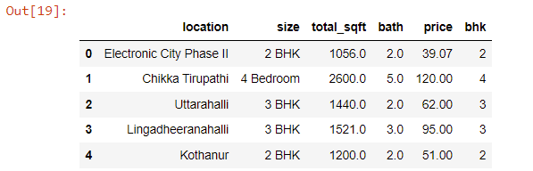

 

Add new feature called price per square feet.

 

    df5 = df4.copy()
    df5["price_per_sqft"] = df5["price"]*100000/df5["total_sqft"]
    df5.head()

 

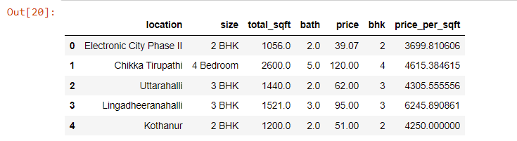

 

Examine locations which is a categorical variable. We need to apply dimensionality reduction technique here to reduce number of locations.

 

    df5.location = df5.location.apply(lambda x: x.strip())
    location_stats = df5["location"].value_counts(ascending = False)
    location_stats

 

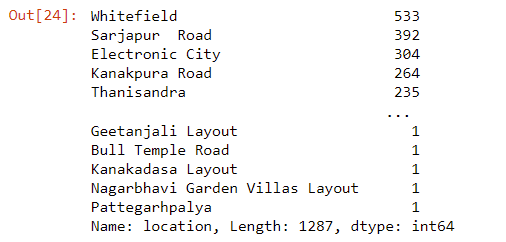

## Dimensionality Reduction

Any location having less than 10 data points should be tagged as "other" location. This way number of categories can be reduced by huge amount. Later on when we do one hot encoding, it will help us with having fewer dummy columns.

 

    location_stats_less_than_10 = location_stats[location_stats<=10]
    location_stats_less_than_10

 

    df5.location = df5.location.apply(lambda x: "other" if x in location_stats_less_than_10 else x)

 

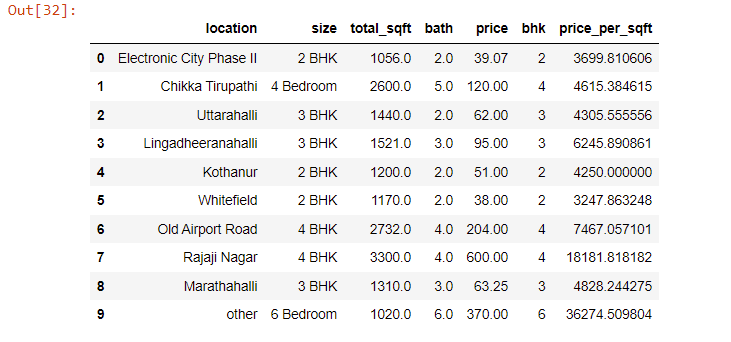

 

## Outlier Removal

### Outlier Removal Using Business Logic

As a data scientist when you have a conversation with your business manager (who has expertise in real estate), he will tell you that normally square ft per bedroom is 300 (i.e. 2 bhk apartment is minimum 600 sqft. If you have for example 400 sqft apartment with 2 bhk than that seems suspicious and can be removed as an outlier. We will remove such outliers by keeping our minimum thresold per bhk to be 300 sqft

 

    df6 = df5[~(df5.total_sqft/df5.bhk<300)]

### Outlier Removal Using Standard Deviation and Mean

Here we find that min price per sqft is 267 rs/sqft whereas max is 12000000, this shows a wide variation in property prices. We should remove outliers per location using mean and one standard deviation

 

    def remove_pps_outliers(df) :
        df_out = pd.DataFrame()
        for key, subdf in df.groupby("location") :
            m = np.mean(subdf.price_per_sqft)
            st = np.std(subdf.price_per_sqft)
            reduced_df = subdf[(subdf.price_per_sqft>(m-st)) & (subdf.price_per_sqft <= (m+st))]
            df_out = pd.concat([df_out, reduced_df], ignore_index = True)
        return df_out
    df7 = remove_pps_outliers(df6)
    df7.shape

 

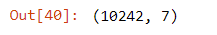

 

**Let's check if for a given location how does the 2 BHK and 3 BHK property prices look like**

 

    def plot_scatter_chart(df,location) :
        bhk2 = df[(df.location == location) & (df.bhk == 2)]
        bhk3 = df[(df.location == location) & (df.bhk == 3)]
        matplotlib.rcParams["figure.figsize"] = (15,10)
        plt.scatter(bhk2.total_sqft, bhk2.price, color = "blue", label = "2 BHK", s = 50)
        plt.scatter(bhk3.total_sqft, bhk3.price, marker = "+", color = "green", label = "2 BHK", s = 50)
        plt.xlabel("Total Square Feet Area")
        plt.ylabel("Price (Lakh Indian Ruppes)")
        plt.title(location)
        plt.legend()
    
    plot_scatter_chart(df7, "Rajaji Nagar")

 

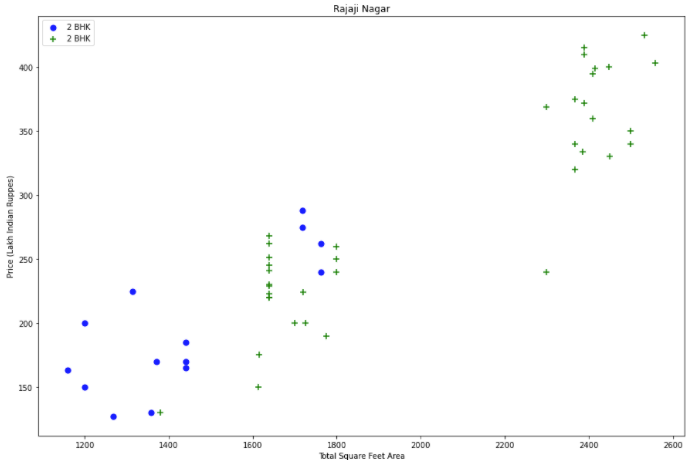

 

**We should also remove properties where for same location, the price of (for example) 3 bedroom apartment is less than 2 bedroom apartment (with same square ft area). What we will do is for a given location, we will build a dictionary of stats per bhk, i.e**

 

    def remove_bhk_outliers(df) :
        exclude_indices = np.array([])
        for location, location_df in df.groupby("location") :
        bhk_stats = {}
            for bhk, bhk_df in location_df.groupby("bhk") :
                bhk_stats[bhk] = {
                    "mean" : np.mean(bhk_df.price_per_sqft),
                    "std" : np.std(bhk_df.price_per_sqft),
                    "count" : bhk_df.shape[0]
                }
            for bhk, bhk_df in location_df.groupby("bhk"):
                stats = bhk_stats.get(bhk - 1)
                if stats and stats["count"]> 5 :
                    exclude_indices = np.append(exclude_indices, bhk_df[bhk_df.price_per_sqft<(stats["mean"])].index.values)
    return df.drop(exclude_indices, axis="index")
    df8 = remove_bhk_outliers(df7)
    df8.shape

 

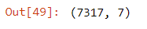

 

**Based on above charts we can see that data points highlighted in red below are outliers and they are being removed due to remove_bhk_outliers function**

 

***Before and after outlier removal: Rajaji Nagar***

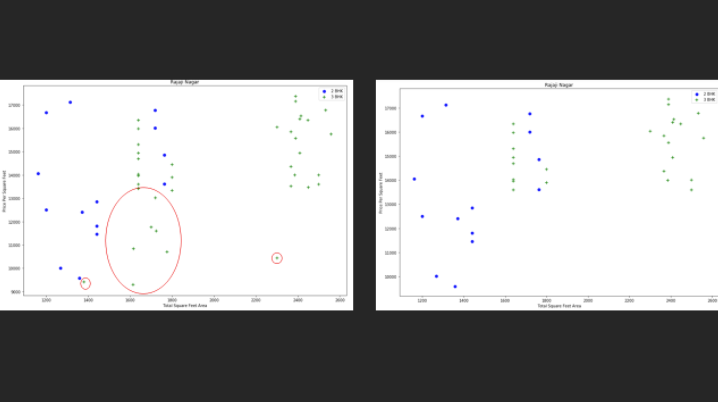

 

***Before and after outlier removal: Hebbal***

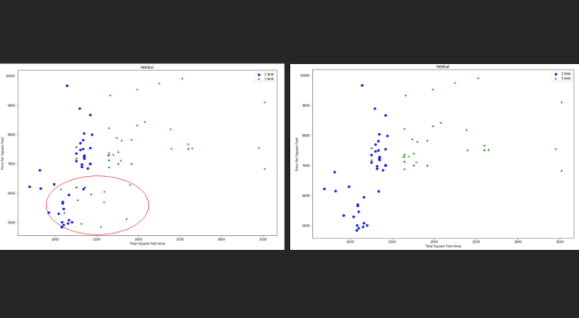

 

### Outlier Removal Using Bathrooms Feature

It is unusual to have 2 more bathrooms than number of bedrooms in a home

 

Again the business manager has a conversation with you (i.e. a data scientist) that if you have 4 bedroom home and even if you have bathroom in all 4 rooms plus one guest bathroom, you will have total bath = total bed + 1 max. Anything above that is an outlier or a data error and can be removed

 

    df9 = df8[df8.bath<df8.bhk+2]

## One Hot Encoding

    dummies = pd.get_dummies(df10.location)
    dummies.head()

 

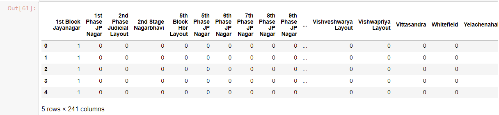

    df11 = pd.concat([df10, dummies.drop("other",axis = "columns")], axis = 
    "columns")

 

    df12 = df11.drop("location",axis="columns")

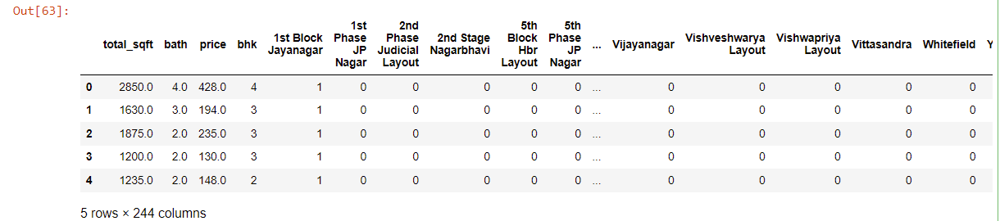

## Build a Model

    X = df12.drop(["price"], axis="columns")

    y = df12.price

 

    from sklearn.model_selection import train_test_split
    X_train, X_test, y_train, y_test = train_test_split(X,y,test_size=0.2,random_state=10)

 

    from sklearn.linear_model import LinearRegression
    lr_clf = LinearRegression()
    lr_clf.fit(X_train, y_train)
    lr_clf.score(X_test, y_test)

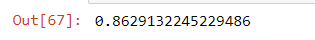

## K Fold Cross Validation

Use K Fold cross validation to measure accuracy of our LinearRegression model

 

    from sklearn.model_selection import ShuffleSplit
    from sklearn.model_selection import cross_val_score

    cv = ShuffleSplit(n_splits = 5, test_size = 0.2, random_state=0)

    cross_val_score(LinearRegression(), X, y, cv=cv)

 

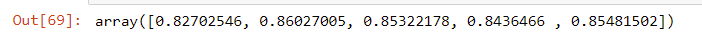

 

We can see that in 5 iterations we get a score above 80% all the time. This is pretty good but we want to test few other algorithms for regression to see if we can get even better score. We will use GridSearchCV for this purpose

## Test The Model

    def predict_price(location, sqft, bath, bhk) :
        loc_index = np.where(X.columns==location)[0][0]

    x = np.zeros(len(X.columns))
    x[0] = sqft
    x[1] = bath
    x[2] = bhk
    if loc_index >= 0 :
        x[loc_index] = 1
    
    return lr_clf.predict([x])[0]

 

    predict_price('1st Phase JP Nagar',1000, 2, 2)

 

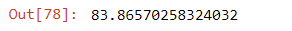

 

## 10) Export The Tested Model

    import pickle
    with open('banglore_home_prices_model.pickle','wb') as f:
    pickle.dump(lr_clf,f)
